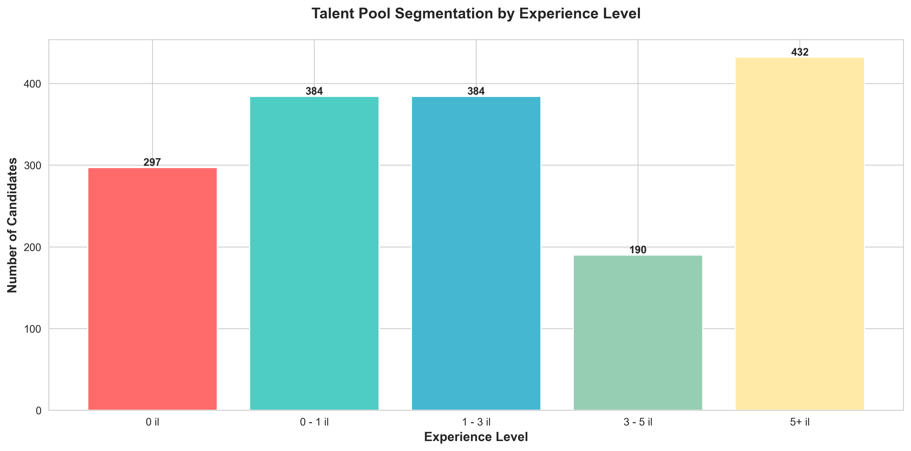
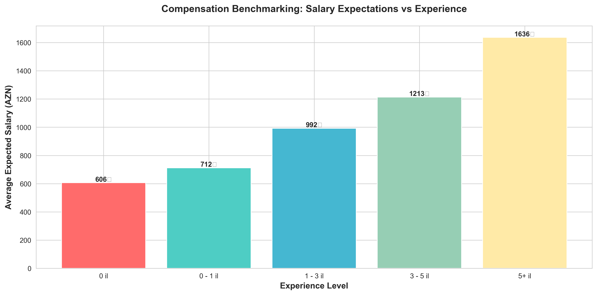
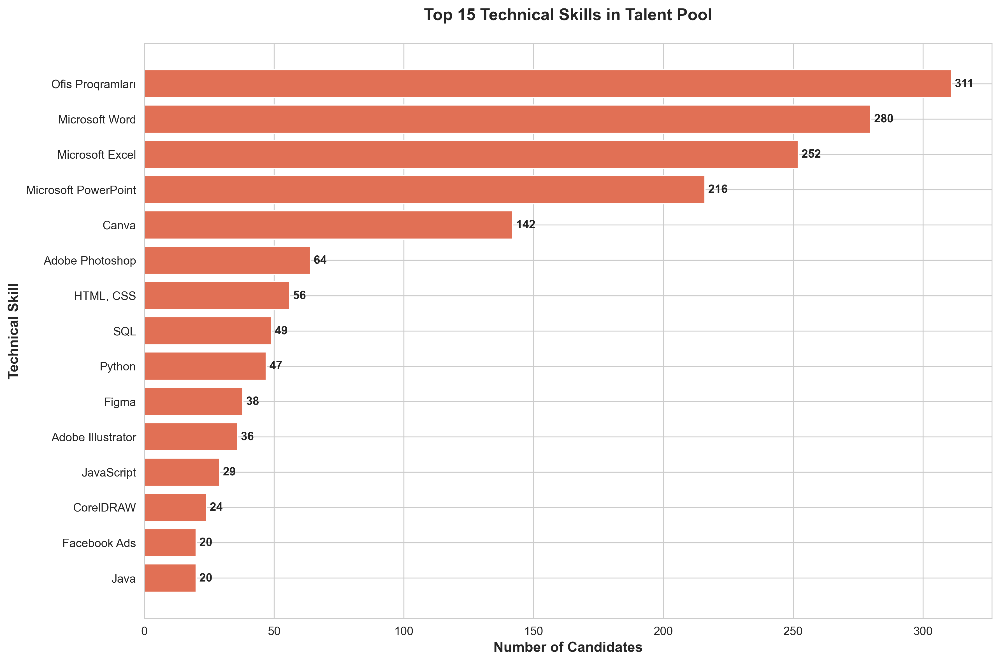
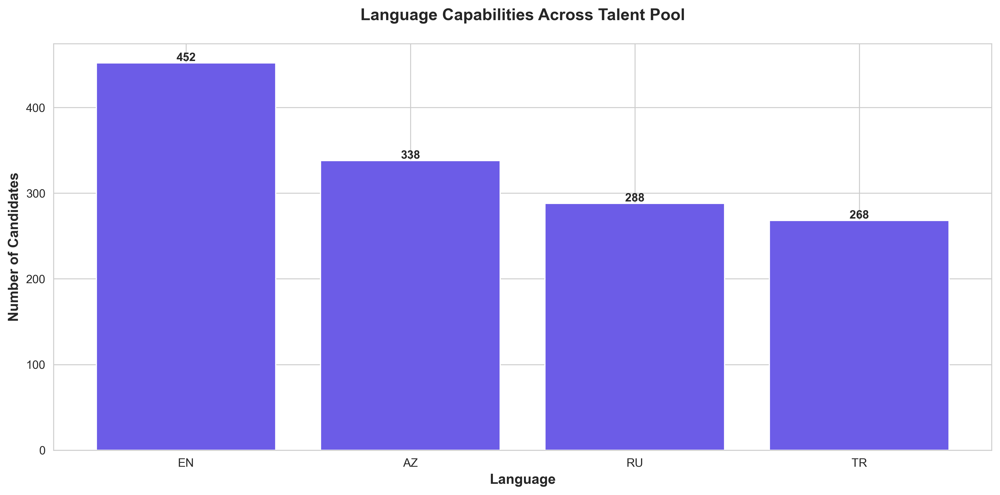
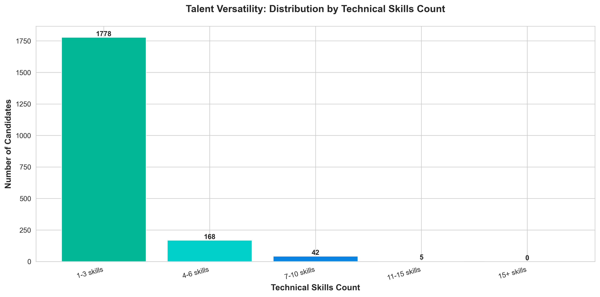
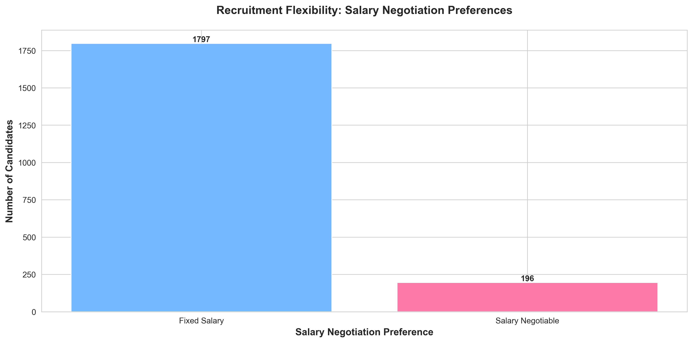
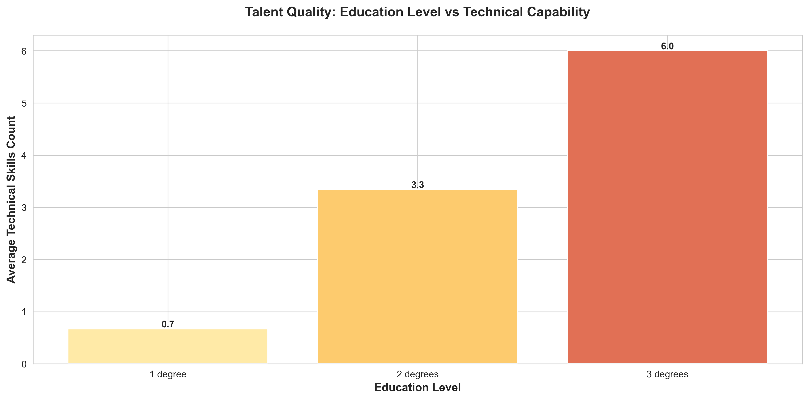
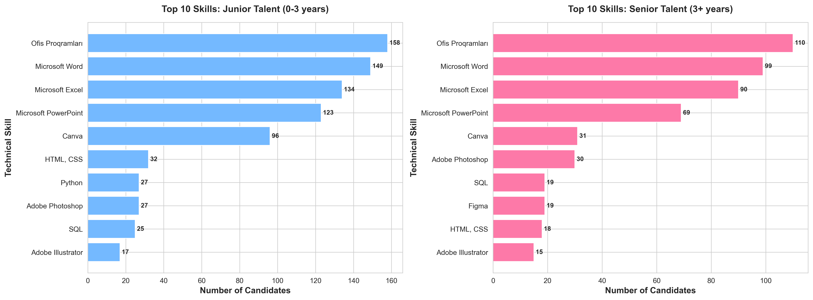
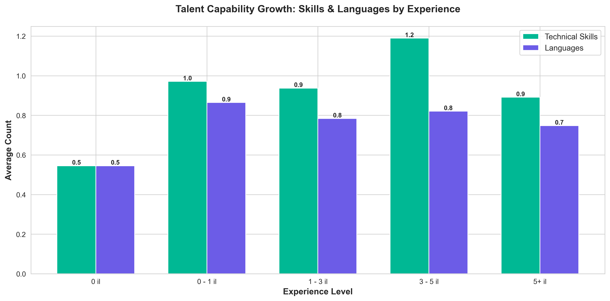
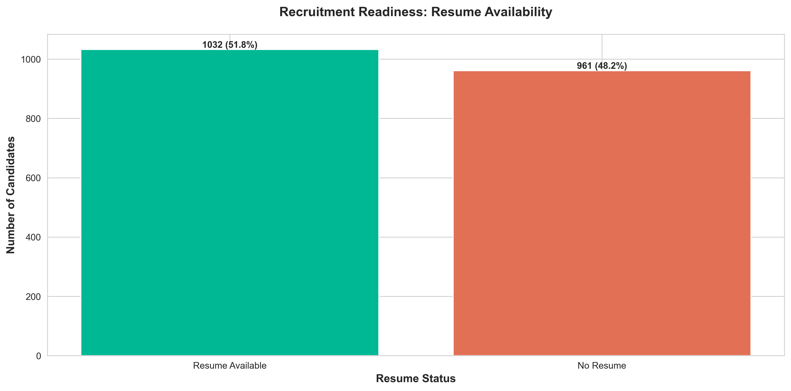

# Work.az Talent Market Analysis
## Executive Summary for Strategic Decision-Making

**Analysis Date:** December 2024
**Dataset:** 1,993 Active Job Seekers on Work.az Platform
**Purpose:** Strategic insights for talent acquisition, compensation planning, and market positioning

---

## Key Findings Overview

This analysis reveals critical patterns in Azerbaijan's talent market that can inform:
- **Recruitment Strategy:** Where to find qualified candidates and how to engage them
- **Compensation Planning:** Market-competitive salary ranges by experience level
- **Skills Gap Analysis:** Most in-demand capabilities versus available talent
- **Market Opportunities:** Underserved segments and competitive advantages

---

## 1. Talent Pool Composition: Understanding Your Candidate Market

### What This Shows
The talent market is dominated by mid-level professionals, with experienced talent (3+ years) representing the largest segment. Entry-level candidates form the smallest group.

### Business Impact
- **For Hiring Managers:** Competition for 3-5 year experienced professionals will be highest
- **For Workforce Planning:** Limited entry-level talent suggests need for robust training programs
- **For Competitive Positioning:** Companies targeting senior talent face less competition
- **Strategic Recommendation:** Consider "grow your own" programs to develop junior talent into mid-level roles

---

## 2. Market Salary Expectations: Compensation Benchmarking

### What This Shows
The majority of candidates expect salaries in the 1,001-2,000 AZN range, with a significant portion willing to work for 501-1,000 AZN. High-salary expectations (2,001-5,000 AZN) represent a smaller segment.

### Business Impact
- **Budget Planning:** Most candidates align with mid-range compensation budgets
- **Cost Optimization:** Large talent pool available at 1,001-2,000 AZN range reduces salary pressure
- **Premium Talent:** Only a limited pool commands 2,001+ AZN salaries
- **Strategic Recommendation:** Position compensation packages in the 1,001-2,000 AZN range to access the largest talent pool while remaining competitive

---

## 3. Experience vs. Compensation: ROI on Talent Investment

### What This Shows
Salary expectations increase predictably with experience, but the growth rate accelerates significantly after 3 years. The jump from mid-level to senior compensation is substantial.

### Business Impact
- **Retention Strategy:** Significant salary jumps at 3-5 years indicate high flight risk
- **Promotion Timing:** Expect compensation pressure at the 3-year mark
- **Hiring Economics:** Mid-level talent (1-3 years) offers best value-to-cost ratio
- **Strategic Recommendation:** Implement retention programs and clear advancement paths at the 3-year milestone to prevent turnover

---

## 4. In-Demand Skills: Market Capability Landscape

### What This Shows
Office productivity tools (Microsoft Office suite) dominate, followed by web technologies (HTML/CSS, JavaScript), design tools (Adobe Photoshop, Figma), and digital marketing skills (SEO, Google Analytics, Facebook Ads).

### Business Impact
- **Recruitment Focus:** Office skills are widely available; specialized tech skills are scarcer
- **Skills Gap:** Advanced technical capabilities (Python, SQL, Java) have lower market penetration
- **Training Opportunities:** High demand for digital marketing and web development skills
- **Competitive Advantage:** Companies needing specialized technical skills should invest in training
- **Strategic Recommendation:** For specialized roles, prioritize aptitude and train on the job rather than waiting for perfectly-skilled candidates

---

## 5. Language Capabilities: Global Market Readiness

### What This Shows
Azerbaijani (AZ) is universal, followed by strong English (EN) and Russian (RU) capabilities. Turkish (TR) represents a significant fourth language.

### Business Impact
- **International Expansion:** Strong English base supports global business operations
- **Regional Markets:** Russian and Turkish capabilities enable CIS and Turkish market access
- **Communication Strategy:** Majority of talent can operate in multilingual environments
- **Client Services:** Language diversity supports diverse customer base
- **Strategic Recommendation:** Leverage multilingual talent for regional expansion and international client servicing

---

## 6. Talent Versatility: Skill Breadth Analysis

### What This Shows
Most candidates possess 1-6 technical skills. Highly versatile talent (7+ skills) represents a smaller, specialized segment.

### Business Impact
- **Role Specialization:** Most candidates suited for focused roles rather than generalist positions
- **Team Building:** Complementary hiring may be more effective than seeking "unicorn" candidates
- **Skill Development:** Opportunity to cross-train employees to increase versatility
- **Market Reality:** Don't over-specify job requirements; 3-6 skills is the realistic baseline
- **Strategic Recommendation:** Build diverse teams rather than seeking individuals with exhaustive skill sets

---

## 7. Recruitment Flexibility: Negotiation Opportunities

### What This Shows
The overwhelming majority of candidates prefer fixed salary structures over "salary by agreement" arrangements.

### Business Impact
- **Compensation Transparency:** Candidates expect clear salary ranges in job postings
- **Negotiation Strategy:** Limited room for salary negotiation with most candidates
- **Budgeting:** Predictable compensation costs due to candidate preference for fixed terms
- **Competitive Positioning:** Clear salary communication improves candidate attraction
- **Strategic Recommendation:** Include transparent salary ranges in job postings to attract maximum candidate pool and reduce negotiation cycles

---

## 8. Education vs. Skills: Quality Indicators

### What This Shows
Technical skill count increases with education level, but the relationship is not linear. Multiple degrees correlate with broader skill sets.

### Business Impact
- **Hiring Criteria:** Education level serves as a proxy for learning capacity and skill diversity
- **Development Potential:** Higher-educated candidates more likely to expand skill sets
- **ROI on Training:** Candidates with multiple degrees may absorb training faster
- **Talent Screening:** Use education as one of several quality indicators, not the sole criterion
- **Strategic Recommendation:** For roles requiring continuous learning, prioritize candidates with demonstrated educational commitment

---

## 9. Junior vs. Senior Talent: Strategic Skill Differences

### What This Shows
**Junior Talent:** Office productivity tools, basic design (Canva), and fundamental web skills dominate
**Senior Talent:** Advanced web technologies (JavaScript, HTML/CSS), professional design tools (Adobe, Figma), and technical skills (SQL, Python) become more prevalent

### Business Impact
- **Hiring Strategy:** Junior talent better suited for operational/administrative roles
- **Senior Positioning:** Technical and creative leadership requires senior talent
- **Career Pathways:** Clear skill progression from junior to senior levels visible
- **Training Investment:** Junior talent needs significant upskilling for technical advancement
- **Strategic Recommendation:**
  - Hire junior talent for support roles and invest in structured development programs
  - Reserve senior hires for technical leadership and specialized project work

---

## 10. Capability Growth Trajectory: Experience-Driven Development

### What This Shows
Both technical skills and language proficiency increase with experience, with the steepest growth occurring in the first 3 years.

### Business Impact
- **Training ROI:** Early-career investment yields highest skill development returns
- **Retention Economics:** First 3 years represent peak learning period; retention critical
- **Career Development:** Natural skill acquisition plateaus after 5+ years without intervention
- **Competitive Advantage:** Companies with strong development programs can accelerate capability growth
- **Strategic Recommendation:** Implement intensive training and mentorship for employees in their first 3 years to maximize capability development and ensure retention

---

## 11. Recruitment Readiness: Candidate Preparedness

### What This Shows
Only a small fraction of candidates have resumes readily available on the platform.

### Business Impact
- **Hiring Friction:** Most candidates require additional steps to submit applications
- **Speed to Hire:** Resume requests add time to recruitment process
- **Candidate Quality:** Resume availability may indicate higher job-search motivation
- **Process Optimization:** Expect slower response rates from candidates without uploaded resumes
- **Strategic Recommendation:**
  - Prioritize candidates with available resumes for faster hiring cycles
  - Simplify application process to accommodate candidates without uploaded documentation
  - Consider resume availability as an indicator of active job seeking

---

## 12. Global Market Positioning: Multilingual Advantage

### What This Shows
The vast majority of talent is bilingual or trilingual, with significant multilingual (4+ languages) capability available.

### Business Impact
- **International Operations:** Strong talent base for global business expansion
- **Customer Service:** Multilingual support teams readily available
- **Market Differentiation:** Language capabilities enable diverse market access
- **Cultural Intelligence:** Multilingual talent often brings cross-cultural competencies
- **Strategic Recommendation:** Leverage multilingual capabilities for:
  - International client servicing
  - Regional market expansion (Russia, Turkey, English-speaking markets)
  - Diverse team building for global projects

---

## Strategic Action Items

Based on this analysis, leadership should consider:

### Immediate Actions (0-3 Months)
1. **Revise Compensation Bands:** Align salary ranges with market expectations (1,001-2,000 AZN sweet spot)
2. **Update Job Postings:** Include transparent salary ranges to maximize candidate attraction
3. **Prioritize Active Candidates:** Focus initial outreach on candidates with available resumes
4. **Skill Specification Review:** Ensure job requirements align with realistic market skill levels (3-6 skills baseline)

### Short-Term Initiatives (3-6 Months)
1. **Retention Program Design:** Target 3-year employees with advancement opportunities to prevent turnover
2. **Training Curriculum Development:** Bridge skills gaps in high-demand areas (technical skills, digital marketing)
3. **Junior Talent Pipeline:** Establish entry-level recruitment and development programs
4. **Multilingual Strategy:** Leverage language capabilities for market expansion planning

### Long-Term Strategy (6-12 Months)
1. **Career Pathways Framework:** Document clear progression from junior to senior roles
2. **Competitive Intelligence:** Regular market analysis to track salary and skill trends
3. **Employer Branding:** Position company as development-focused to attract learning-oriented candidates
4. **Skills Investment:** Build internal training programs for scarce technical capabilities

---

## Market Opportunities

### Underserved Segments
- **Entry-level talent development:** Small pool presents opportunity for companies willing to invest in training
- **Specialized technical skills:** Limited availability of advanced technical capabilities creates competitive advantage for skill developers

### Competitive Advantages
- **Multilingual operations:** Azerbaijan's talent base supports multi-market strategies
- **Cost-effective mid-level talent:** Large pool of 1-3 year experienced professionals at competitive rates
- **Flexible skill development:** Most talent has baseline capabilities that can be expanded

### Risk Factors
- **Mid-level retention:** High competition for 3-5 year experienced professionals
- **Technical skill scarcity:** Advanced technical roles may require extended search times or internal development
- **Salary pressure:** Experience-based compensation expectations accelerate significantly at senior levels

---

## Conclusion

Azerbaijan's talent market presents a mature, multilingual workforce with strong baseline capabilities and clear compensation expectations. The key to successful talent strategy lies in:

1. **Realistic positioning:** Align expectations with market realities (skill levels, compensation)
2. **Development investment:** Bridge skills gaps through training rather than prolonged searching
3. **Retention focus:** Protect mid-level talent investments with clear advancement paths
4. **Strategic hiring:** Balance junior development with strategic senior hires

Organizations that understand these market dynamics and align their talent strategies accordingly will achieve competitive advantage in recruitment, retention, and capability building.

---

**For strategic discussions or deeper analysis of specific talent segments, contact your HR leadership team.**
